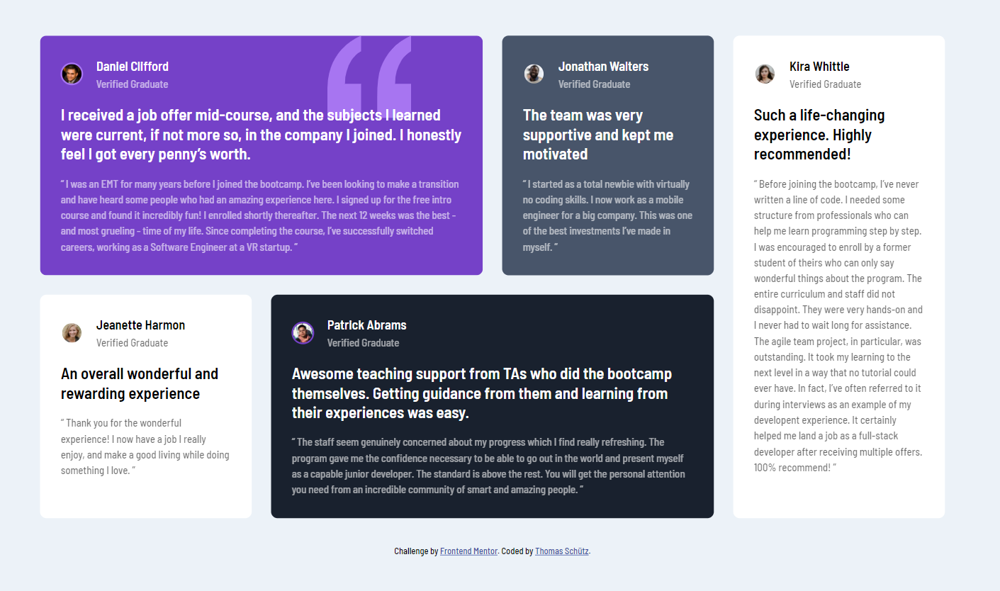
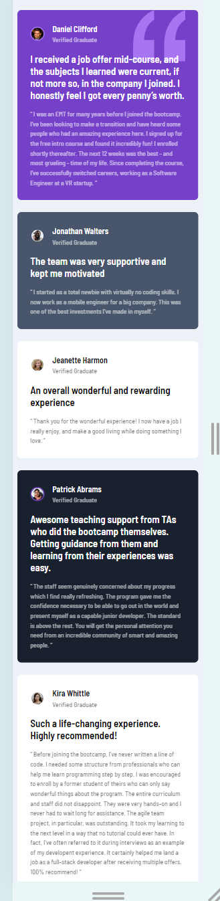

# Frontend Mentor - Testimonials grid section solution

This is a solution to the [Testimonials grid section challenge on Frontend Mentor](https://www.frontendmentor.io/challenges/testimonials-grid-section-Nnw6J7Un7). Frontend Mentor challenges help you improve your coding skills by building realistic projects.

## Table of contents

- [Overview](#overview)
  - [The challenge](#the-challenge)
  - [Screenshot](#screenshot)
  - [Links](#links)
- [My process](#my-process)
  - [Built with](#built-with)
  - [What I learned](#what-i-learned)
  - [Useful resources](#useful-resources)
- [Author](#author)

## Overview

### The challenge

Users should be able to:

- View the optimal layout for the site depending on their device's screen size

### Screenshot




### Links

- [Solution URL](https://github.com/Nospiel-code/fm-testimonial-grid-section)
- [Live Site URL](https://nospiel-code.github.io/fm-testimonial-grid-section/)

## My process

### Built with

- Semantic HTML5 markup
- CSS custom properties
- Flexbox
- CSS Grid
- Mobile-first workflow

### What I learned

In this challenge I learned how to make a grid using the **grid-template-areas**

```css
main {
  display: grid;
  grid-auto-columns: 1fr;
  gap: 1.5rem;
  grid-template-areas:
    "one"
    "two"
    "three"
    "four"
    "five";

  padding-block: 2rem;
  width: min(95%, 70rem);
  margin-inline: auto;
}

@media screen and (min-width: 33rem) {
  main {
    grid-template-areas:
      "one one"
      "two three"
      "four four"
      "five five";
  }
}

@media screen and (min-width: 54rem) {
  main {
    grid-template-areas:
      "one one two"
      "three four four"
      "five five five";
  }
}

@media screen and (min-width: 75rem) {
  main {
    grid-template-areas:
      "one one two five"
      "three four four five";
  }
}
```

### Useful resources

- [A Complete Guide to CSS](https://css-tricks.com/snippets/css/complete-guide-grid/) - A useful and comprehensible guide on how to build a CSS grid

## Author

- Website - [GitHub](https://github.com/Nospiel-code)
- Frontend Mentor - [@Nospiel-code](https://www.frontendmentor.io/profile/Nospiel-code)
- Twitter - [@tomsdev4](https://www.twitter.com/tomsdev4)
